ANSIBLE CONFIGURATION MANAGEMENT – AUTOMATE PROJECT 7 TO 10

Task:-

A. Install and configure Ansible client to act as a Jump Server/Bastion Host

1. update name tag on jenkins EC2 instance to Jenkins-Ansible 

2. In GitHub account create a new repository and name it ansible-config-mgt.

3. Install Ansible
 - sudo apt update
 - sudo apt install ansible
 
 checke ansible server by running 
 ansible --version
 
 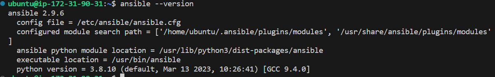

 Note the python version that was installed because ansible runs on python

 4. Configure Jenkins build job to save your repository content every time you make a new commit.
 -Create a new Freestyle project "projectansible" in Jenkins and using the URL of the ‘ansible-config-mgt’ repository.
Configure Webhook in GitHub and set webhook to trigger ansible build.
Configure a Post-build job to save all (**) files

5. Test the setup by making some change in README.MD file in master branch and make sure that builds starts automatically in jenkins

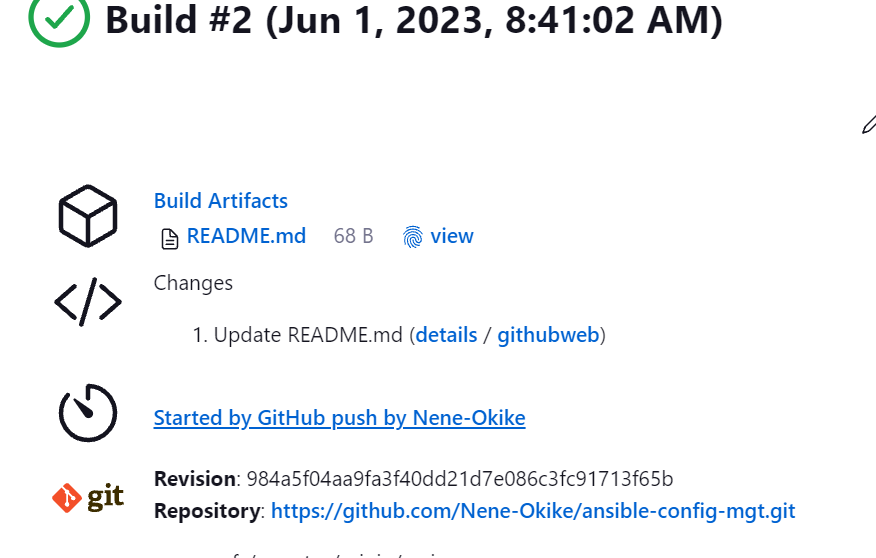

Jenkins saves the files (build artifacts) in Jenkins home in the following file. Run the command to see changes 

cat /var/lib/jenkins/jobs/ansible/builds/2/archive/

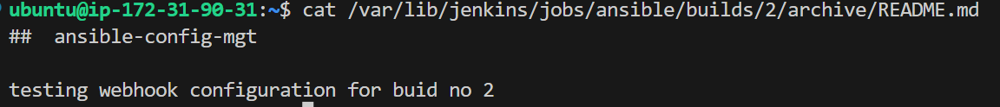

This is the architectural setup of our system.

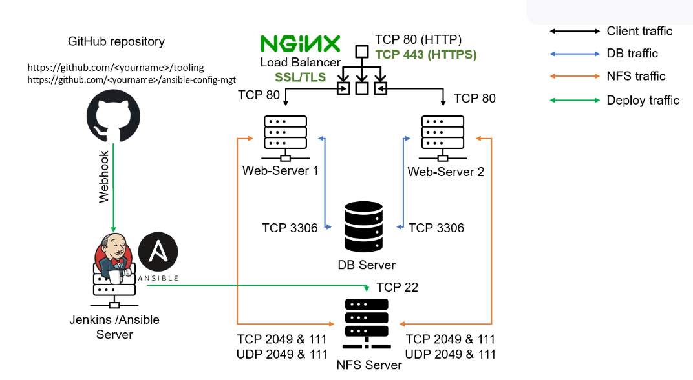

Task 2:
 ###   Create a simple Ansible playbook to automate servers configuration

 1. Clone down your ansible-config-mgt repo to your local environment with this command

`git clone <ansible-config-mgt repo link>'

 2. In the ansible-config-mgt GitHub repository, create and checkout into a new branch, feat/prj-11, that will be used for development of a new feature.
git checkout -b feat/prj-11
 
3. Create a directory and name it playbooks – it will be used to store all playbook files.

4. Create a directory and name it inventory – it will be used to keep  hosts organised.

5. Within the playbooks folder, create a playbook, and name it common.yml

6. Within the inventory folder, create an inventory file (.yml) for each environment (Development, Staging Testing and Production) dev, staging, uat, and prod respectively.

step 3 
### Set up an Ansible Inventory
 1. Run the following commands to import your key into ssh agent
 
  $ eval `ssh-agent -s`
  $ ssh-add jenk.pem

 Confirm that the key has been added with this command ssh-add -l

 ssh into jenkins-ansible server with this command

 $ ssh -A ubuntu@public-IP

 and rerun this command `ssh-add -i`

 2. Confirm that the jenkins-ansible server can connect to the NFS server, Web server 1 and 2, DB and LB servers by running the command `ssh ec2-user@private-IP` or `ssh ubuntu@private-IP` of the respective server to confirm that Jenkins-ansible server can connect to the respective servers.

 3. Update your inventory/dev.yml file with this snippet of code:

[nfs]
<NFS-Server-Private-IP-Address> ansible_ssh_user='ec2-user'

[webservers]
<Web-Server1-Private-IP-Address> ansible_ssh_user='ec2-user'
<Web-Server2-Private-IP-Address> ansible_ssh_user='ec2-user'

[db]
<Database-Private-IP-Address> ansible_ssh_user='ec2-user' 

[lb]
<Load-Balancer-Private-IP-Address> ansible_ssh_user='ubuntu'

Step 4:
### Create a Common Playbook

1. Update your playbooks/common.yml file with following code:

---
- name: update web, nfs and db servers
  hosts: webservers, nfs, db
  remote_user: ec2-user
  become: yes
  become_user: root
  tasks:
    - name: ensure wireshark is at the latest version
      yum:
        name: wireshark
        state: latest

- name: update LB server
  hosts: lb
  remote_user: ubuntu
  become: yes
  become_user: root
  tasks:
    - name: Update apt repo
      apt: 
        update_cache: yes

    - name: ensure wireshark is at the latest version
      apt:
        name: wireshark
        state: latest

Step 5 – Update GIT with the latest code

Commit your code into GitHub:

use git commands to add, commit and push your branch to GitHub by running the following commands:

git status

git add .

git commit -m "commit message"

git push origin feat/prj-11

Go to Github and create a Pull request (PR)

Acting as another developer,
review and accept the changes by merging the PR.
Once the changes are merged in the masters, the webhook will initial a jenkins build 

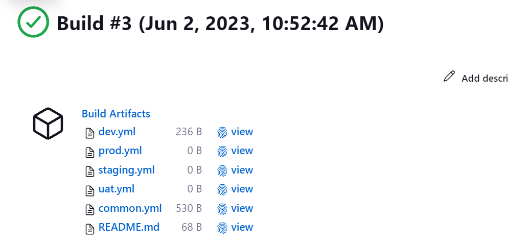

And jenkins will save all the files (build artifacts) to 
/var/lib/jenkins/jobs/ansible/builds/3/archive/ directory on Jenkins-Ansible server.

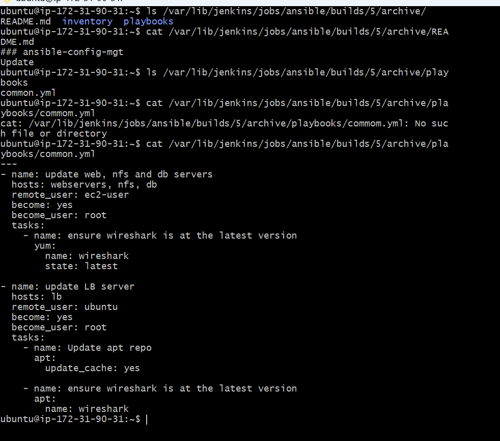

Step 6 – Run first Ansible test

In the jenkins-ansible server,

`cd ansible-config-mgt`

`cd /var/lib/jenkins/workspace/Projectansible`

 and run this command

`ansible-playbook -i inventory/dev.yml playbooks/common.yml`

To confirm that the ansible playbook ran successfully, go to each server and confirm the installation of wireshark  by running `wireshark --version`

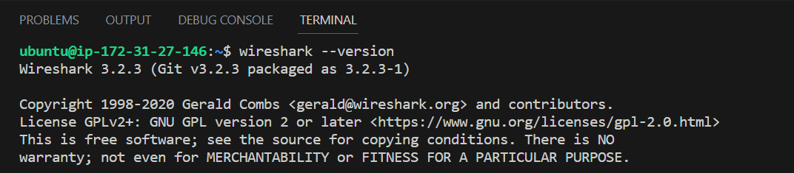

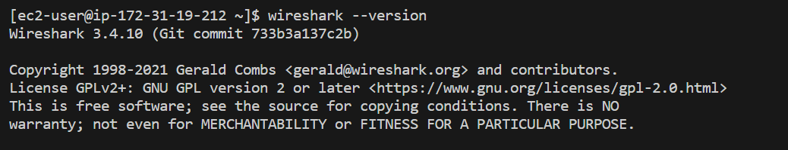

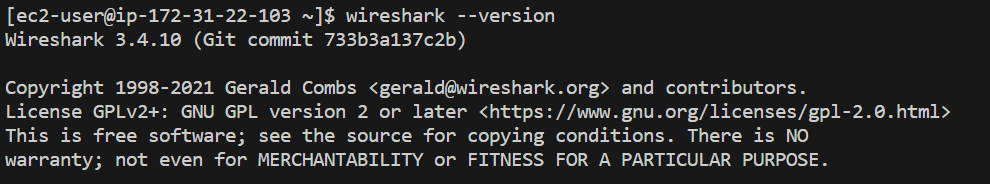

This is our new architecture
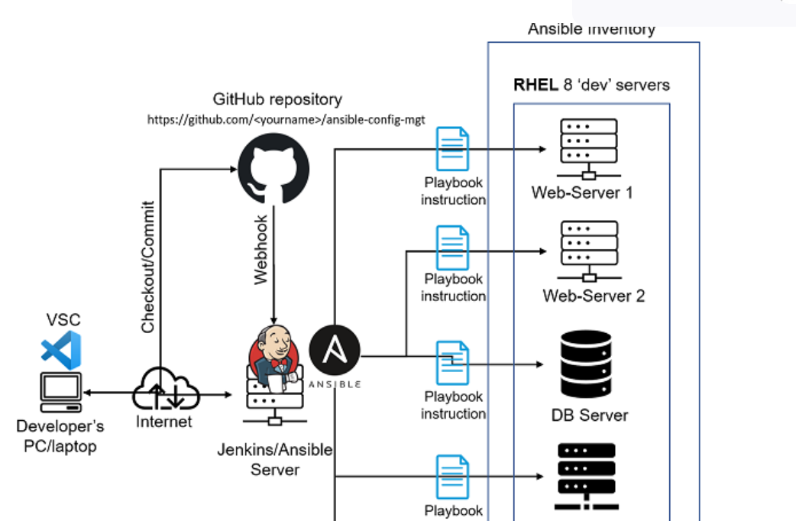

 ### Optional step – Repeat once again
Update your ansible playbook with some new Ansible tasks and go through the full checkout -> change codes -> commit -> PR -> merge -> build -> ansible-playbook cycle again to see how easily you can manage a servers fleet of any size with just one command!

update the playbooks/common.yml with the following codes

---
- name: create directory, file and set timezones on all servers
  hosts: webservers, nfs, db
  become: yes
  tasks:

    - name: create a directory
      file:
        path: /home/sample
        state: directory

- name: create a file
  file:
    path: /home/sample/ansible.txt
    state: touch 
      

    - name: set timezone
      timezone:
        name: Africa/Lagos

update the playbooks/common.yml file in git hub by running

Checkout to feat/prj-11
 `git add playbooks/common.yml`
 `git commit -m "common.yml updated"`
 `git push` 
 Then do a PR and merge with main branch to trigger a push to jenkins and a jenkins job.

 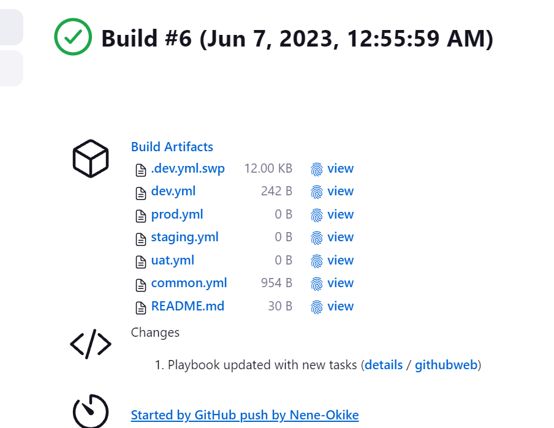
 Then run the ansible playbook with this command 
 `ansible-playbook -i inventory/dev.yml playbooks/common.yml

 Confirm that the playbook ran successfuly by checking the server for the directory "/home/sample" the file "/home/sample/ansible.txt
 and that the time of the servers are set to Africa/Lagos time.
 
 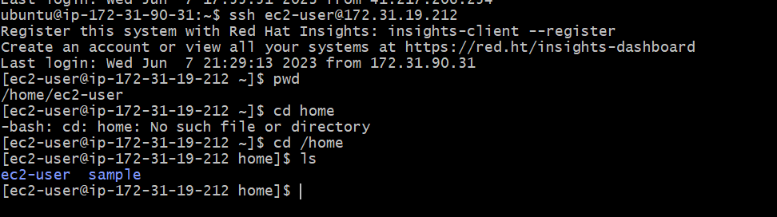

 

